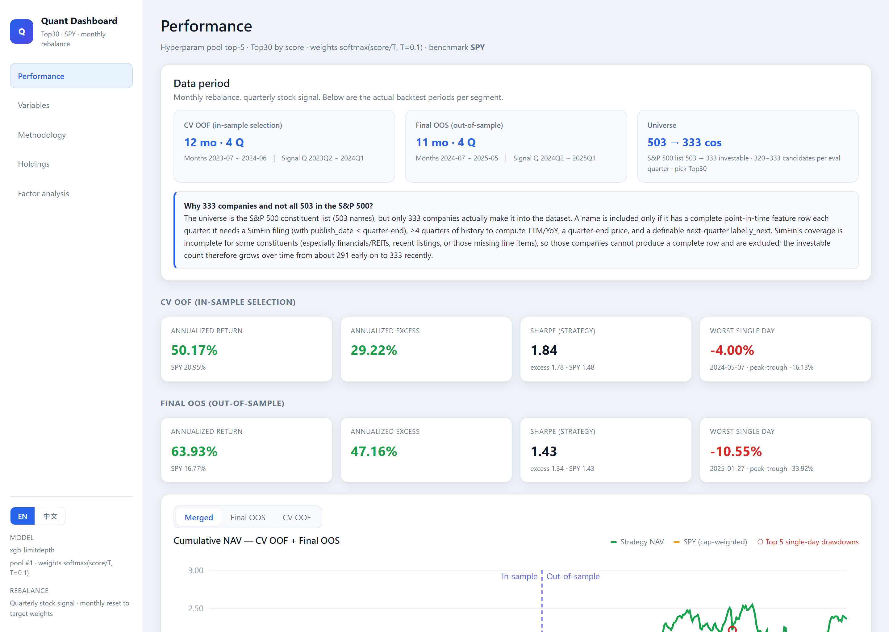

# S&P 500 Quant ML Dashboard

End-to-end quant research pipeline that predicts next-quarter S&P 500 outperformers and
turns them into a monthly-rebalanced portfolio, with an interactive dashboard for
performance, model variables, validation methodology, holdings, and factor analysis.

**Live demo:** https://jeremylin0904.github.io/sp500-quant-dashboard/



---

## What it does

- **Universe:** S&P 500 only; benchmark **SPY** (cap-weighted S&P 500 ETF).
- **Target `y_next`:** will a stock be in the next quarter's **excess-return Top 30** (vs SPY)?
- **Features:** 40+ point-in-time fundamentals from SimFin (TTM ratios, YoY growth, valuation,
  leverage, momentum, sector-relative ranks). See [`quant/model/MODEL_VARIABLES.md`](quant/model/MODEL_VARIABLES.md).
- **Model:** FLAML AutoML (gradient-boosted trees; NaNs kept via missing branches).
- **Portfolio:** model picks Top 30; weighting scheme chosen jointly with the model.
- **Factor analysis:** Fama-French 5-factor + Momentum OLS on strategy excess returns.

## Validation methodology (no leakage)

1. **TTM warmup** — drop the first 4 quarters (2020Q2–2021Q1); YoY/TTM features need ≥4
   quarters of history and are nearly all NaN before that.
2. **Pool search** — FLAML 120s on the post-warmup, pre-OOS quarters → top-5 model configs.
3. **Walk-forward CV OOF** — top-5 models × 8 weighting schemes evaluated with an expanding
   walk-forward; the (model + weight) pair is selected **only on CV OOF** annualized excess
   Sharpe, then **frozen**.
4. **Final OOS** — the frozen config is retrained expanding-window over the last 4 quarters
   (2024Q2–2025Q1); this segment never participates in selection.

Selection **never** looks at Final OOS. Historical-quarter scores come from
`walk_forward_scores.parquet`, never from the deployment model fit on all quarters.

## Dashboard tabs

The dashboard ships bilingual (English default, 中文 toggle) and each tab has its own
shareable URL via the hash route (e.g. `#/factor`).

| Tab | Content |
|-----|---------|
| Performance | KPIs (annualized return/excess, Sharpe, single-day max drawdown), daily NAV vs SPY, top-5 single-day drawdowns linked to the news that caused them, Top30 confusion matrices, monthly returns |
| Model variables | All feature formulas + raw-data lineage (rendered from `MODEL_VARIABLES.md`) and live missingness/percentile stats |
| Methodology | Flow steps, quarter timeline, expanding walk-forward fold diagram, hyperparameter-pool × weight-scheme CV OOF table |
| Holdings | Per-quarter Top30 picks (predicted weight/score vs realized next-quarter return) and hit-rate vs actual Top30 |
| Factor analysis | FF5 + Momentum alpha and factor betas per segment |

---

## Local development

```bash
pip install -r requirements.txt
cd frontend && npm install && cd ..

# Build artifacts: raw -> curated -> features/labels -> AutoML -> walk-forward backtest
python scripts/build_all.py --force

# Backend (FastAPI) on :8001
python -m uvicorn backend.main:app --reload --port 8001

# Frontend (Vite) on :5173, proxies /api -> :8001
cd frontend && npm run dev
```

Open http://localhost:5173

## Static build & deploy (GitHub Pages)

The dashboard is read-only, so the API is pre-rendered to static JSON and the whole app
ships as a static site (no server needed).

```bash
# 1) Export every endpoint to frontend/public/api/*.json
python scripts/export_static_api.py

# 2) Build (base path = /sp500-quant-dashboard/)
cd frontend && npm run build

# 3) Publish dist/ to the gh-pages branch
npx gh-pages -d dist --dotfiles
```

Re-run all three after regenerating artifacts to refresh the live site.

## Real data (SimFin)

Without a key the pipeline falls back to reproducible sample data. For real data, create a
`.env` in the repo root (see `.env.example`):

```
SIMFIN_API_KEY=your_key
```

then rerun `python scripts/build_all.py --force`. SimFin has no explicit CapEx/FCF column,
so a proxy is derived from `Change in Fixed Assets & Intangibles`.

## Project structure

```
quant/
  config.py            # universe, label/holdings N, warmup, weight-scheme pool
  pipeline/            # build_curated -> features -> labels -> dataset -> train_model -> backtest
  model/               # model_meta.json, feature_stats.csv, MODEL_VARIABLES.md, parquet scores
  backtest/            # performance_report / monthly / daily / holdings / drawdown_news JSON
  factor/              # factor_analysis.json
backend/               # FastAPI: routers + services/data_service.py
frontend/              # React + Vite dashboard (src/App.tsx, components/*)
scripts/               # build_all, export_static_api, factor_analysis, feature_stats, eval_model
.cursor/skills/        # repeatable workflows (dev loop, add endpoint, eval invariants)
```

## API endpoints

`GET /api/backtest/{report,monthly,daily,drawdown-news}` ·
`GET /api/model/{summary,variables}` · `GET /api/factor/analysis` ·
`GET /api/holdings/{signal-quarters,signal/{quarter}}`
